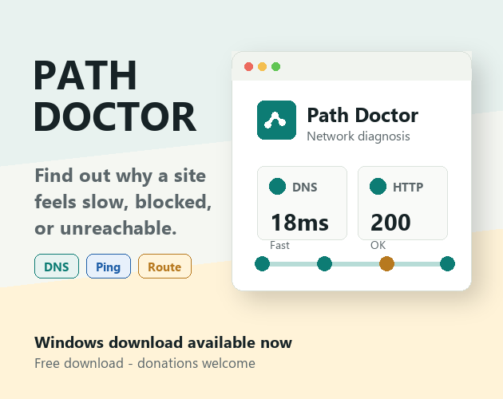
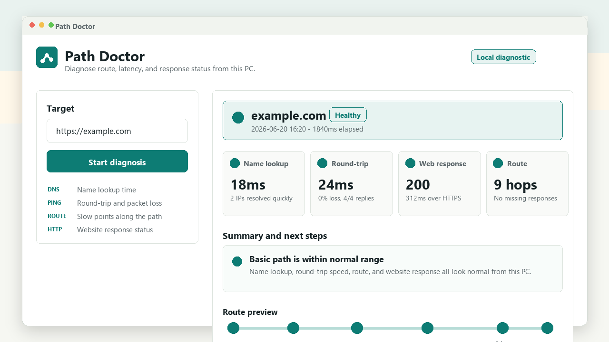
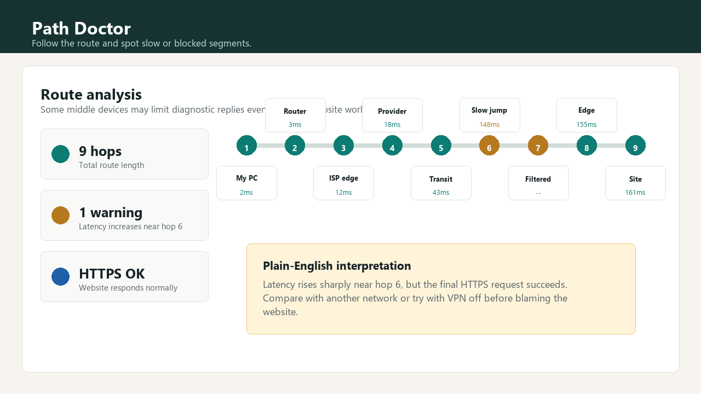
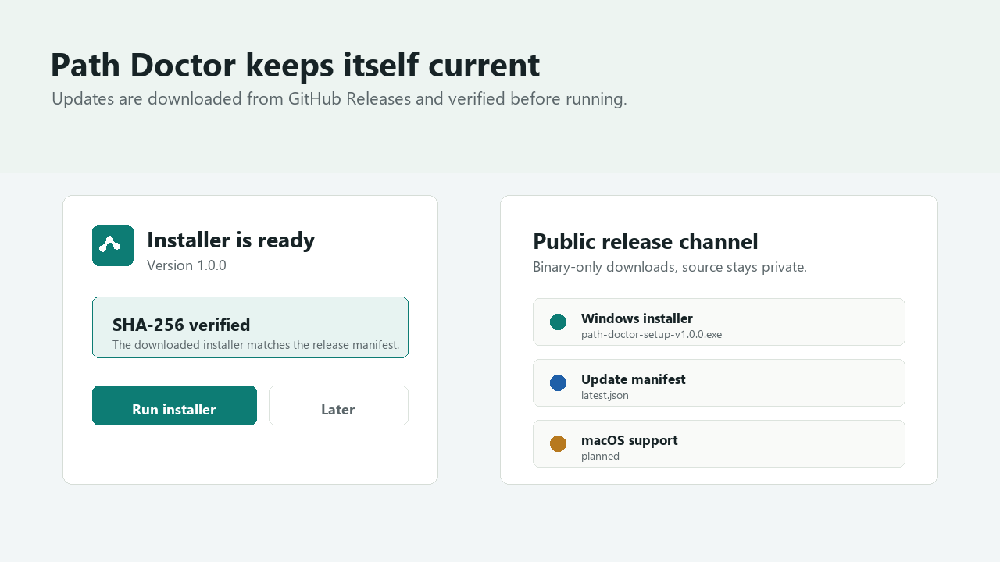

# Path Doctor

[Website](https://uwanggood.github.io/path-doctor-releases/) · [itch.io](https://uwanggood.itch.io/path-doctor) · [Ko-fi](https://ko-fi.com/uwanggood) · [Latest release](https://github.com/Uwanggood/path-doctor-releases/releases/tag/v1.0.0)



Path Doctor is a small Windows desktop tool that helps explain why a website, server, or network route feels slow, blocked, or unreachable.

## Download

- Windows installer: [path-doctor-setup-v1.0.0.exe](https://github.com/Uwanggood/path-doctor-releases/releases/download/v1.0.0/path-doctor-setup-v1.0.0.exe)
- Latest release: [Path Doctor v1.0.0](https://github.com/Uwanggood/path-doctor-releases/releases/tag/v1.0.0)
- itch.io page: [uwanggood.itch.io/path-doctor](https://uwanggood.itch.io/path-doctor)
- Ko-fi support: [ko-fi.com/uwanggood](https://ko-fi.com/uwanggood)

## What It Checks

Path Doctor runs local diagnostics for DNS, ping, routing, HTTP/TLS, proxy, and VPN clues, then turns the result into plain-language guidance.

Use it when:

- a website feels slow or unreachable
- DNS or routing looks suspicious
- you need a support-friendly diagnostic summary
- you want to compare local network behavior before blaming an app, ISP, VPN, or server

## Screenshots







## Release Status

- Windows is available now.
- macOS support is planned through the same update channel.
- Updates are distributed from GitHub Releases.

## Safety Note

This first public build is not code-signed yet, so Windows SmartScreen may show a warning.
Only download Path Doctor from this official release repository, the GitHub Pages website, or the linked itch.io page.

Windows v1.0.0 SHA-256:

```text
122250f5f27ba12f1eec2402f501972c2e0a9491dac80a6b15a1d774b896d74e
```

## Source Code

This repository intentionally hosts public binary releases only. The application source code is not published here.
